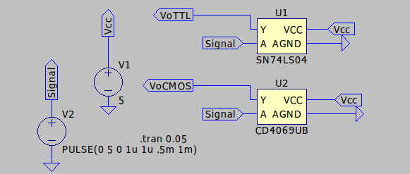
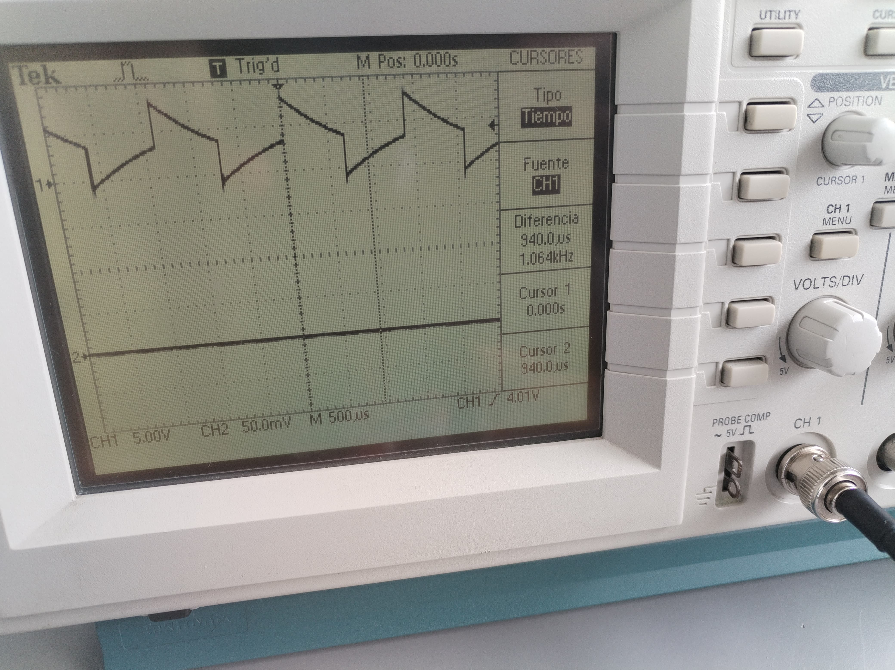

# INFORME 1 - ELECTRÓNICA DIGITAL

Farelo Sanabria, Édgar Enrique efarelo@unal.edu.co

Gómez Romero, Néstor Javier negomezr@unal.edu.co

## Introducción

El presente informe tiene como objetivo comparar dos técnicas de manufactura de puertas lógicas, basados en BJT y en FETs (siendo la TTL y la CMOS, respectivamente). El análisis que se presenta a continuación tiene como parámetros medibles: La velocidad de respuesta, considerando el tiempo de subida y bajada; el fan-in y el fan-out, que interpreta la corriente de entrada y salida de las puertas lógicas y por último el comportamiento oscilatorio en una disposición tipo anillo.

## Desarrollo de la practica

Para el desarrollo de esta práctica primero se consideran simulaciones, con las librerías de los negadores requeridos (TTL 74LS04 y CMOS CD4069).

Con el circuito mostrado anteriormente se buscó probar y desarrollar los 

Estas 3 imágenes hacen referencia a la simulación de los dos negadores y sus correspondientes tiempos de subida y de bajada. Luego, con el conocimiento adquirido por las simulaciones, permitiendo un abrebocas del funcionamiento de los negadores se realizo el siguiente procedimiento en la practica.

### CALCULO TIEMPOS DE RESPUESTA y FAN OUT/IN

En la primera parte de la practica se aplico un voltaje de 5v como alimentación de los negadores (pin # para Vin y pin # para GND) y además se aplico una señal cuadrada, con el fin de observar en el osciloscopio el tiempo de respuesta de pasar de 0 lógico a 1 lógico y viceversa (TPLH y TPHL). Luego con el multímetro se hizo una conexión en serie en los pines ### para obtener la corriente que  me entregaba el circuito con el fin de calcular el fan in y el fan out.

### CIRCUITO ANILLO

Se realizo el siguiente circuito anillo con un voltaje de alimentación de 5v, una capacitancia de 10nf y una resistencias de 68k ohmios

Basándonos en este oscilador de referencia en internet, construimos el oscilador, con los mismos valores, se uso el negador CMOS.

Se midió la frecuencia obtenida por la señal cuadrada generada por el circuito.

Por ultimo se realizo el circuito anillo propuesto en la guía, alimentado con un voltaje de alimentación de 5v 

Luego de montado el circuito se conecto al osciloscopio para medir el tiempo de cambio de estado.

.jpeg)

Terminado estas mediciones tenemos toda la información necesaria para calcular todos los datos requeridos.

## Resultados

Luego de realizada la practica, se registraron los datos de los dos negadores en la siguiente tabla:

| **Parámetro** | **TTL 74LS04** | **CMOS CD4069** |
| --- | --- | --- |
| TPLH(us) | 10.2 | 185 |
| TPHL(us) | 9.4 | 185 |
| I(out)(mA) | 0.02 | 0.01 |
| FAN IN | 1 | 1 |
| FAN OUT | 20 | 50 |

Además se obtuvieron las frecuencias de los circuitos anillos que corresponden a las siguientes:

| **Tipo de Oscilador** | **Frecuencia** |
| --- | --- |
| Oscilador propuesto | 8MHz |
| Oscilador con capacitancia | 1064KHz |

## Análisis de resultados

Revisando la primera parte de la practica (Cálculos de tiempo de respuesta) podemos observar que el negador TTL tiene menor tiempo de respuesta siendo este de 10.2us que el negador CMOS lo que indicaría un mayor uso, pero este no es el único parámetro tenido en cuenta al momento de usar negador, pues, la tecnología CMOS ofrece un consumo mucho menor que la TTL por ende es una mejor opción cuando se tienen en cuenta a varias compuertas necesarias en un diseño. Además, El TPLH y el TPHL en los dos casos tienden a mostrar igualdad en los dos casos, lo que indica simetría en el cambio de estado de los negador. Las corrientes de salida medidas en los dos casos demuestran una similitud en magnitud, pero tiene consecuencias diferentes pues el TTL al tener un mayor consumo ofrece menor FAN OUT que su contraparte de CMOS. Además, se observa una diferencia marcada entre los valores TPLH y TPHL de las simulaciones y lo medido en la practica, seguramente debida a lo que se tuvo en cuenta como inicio del 1 y del 0 logico, pues el dia de la practica se tuvo en cuenta antes del 10% del valor nominal registrado en los datasheet de los dos dispositivos 

En la segunda parte de la practica podemos analizar dos tipos de datos distintos, pues, en el primer oscilador la frecuencia medida corresponde a la lectura de cambio de estado de parte de un negador a otro, es decir, el cambio de 1 a 0 lógico y como este es recibido por la siguiente compuerta de este sistema. Por ende dentro de este dato obtenemos el valor de lectura de un 1 o 0 lógico por parte del siguiente negador, que en este caso corresponde a 125ns, pues se uso un negador CMOS para este anillo, lo que da razón con el TPLH y TPHL que son de 185ns. Por ultimo, el oscilador que fue realizado adicionalmente a la practica contiene información de como realizar una señal cuadrada con 3 componentes (negadores, resistencias y capacitancias), gracias al análisis se puede evidenciar que la frecuencia obtenida que es de 1064KHz es directamente proporcional al RC del sistema que en este caso fue una resistencia de 68KΩ y 10nF.

## Conclusiones

El negador TTL tiene un tiempo de respuesta menor al negador CMOS por su configuración bipolar, pero a su vez es menos eficiente energéticamente.

El negador CMOS es una mejor alternativa ante diseños que requieran mayor numero de compuertas, pues, su eficiencia energética permite un mayor fan out que a su vez significa mayor conexión a varias compuertas.

Los tiempos TPLH y TPHL demuestran equivalencia en los dos negadores, lo que significa que existe simetría en el cambio de estado de los dispositivos.

El tiempo de lectura de una siguiente compuerta, es decir cuando considera que su entrada cambio de un 1 a un 0 esta relacionada con los tiempos de cambio de estado del negador que administra la entrada.

Un oscilador de anillo permite crear una señal cuadrada sin ningún elemento adicional a los negadores, resistencia y capacitancia que estará regulada por el valor RC que se le otorgue a esta.

## Referencias

[1] 74LS04 Datasheet(PDF)- Motorola, Inc.

[https://www.alldatasheet.com/datasheet-pdf/pdf/5638/MOTOROLA/74LS04.html](https://www.alldatasheet.com/datasheet-pdf/pdf/5638/MOTOROLA/74LS04.html)

[2] CD4069 Datasheet(PDF) - Fairchild Semiconductor

[https://www.alldatasheet.com/datasheet-pdf/pdf/50860/FAIRCHILD/CD4069.html](https://www.alldatasheet.com/datasheet-pdf/pdf/50860/FAIRCHILD/CD4069.html)