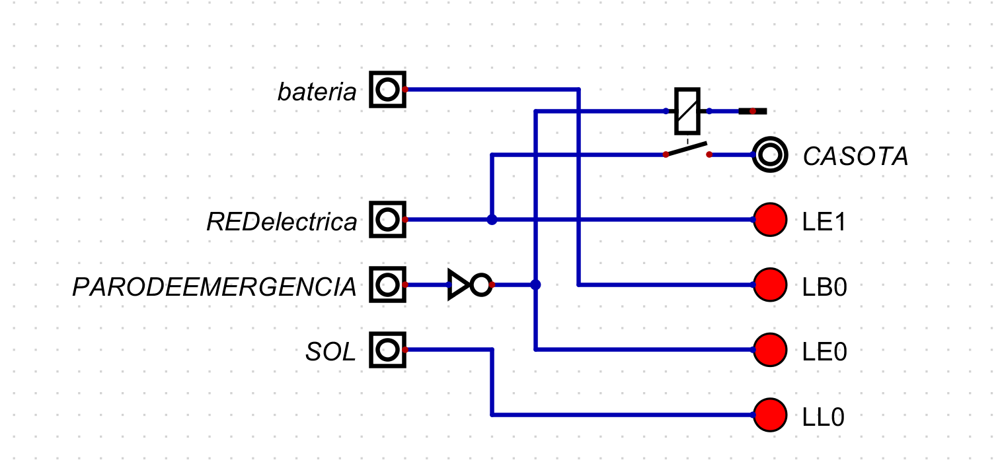
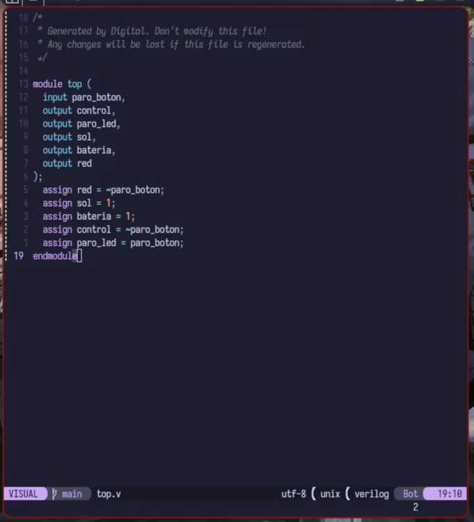
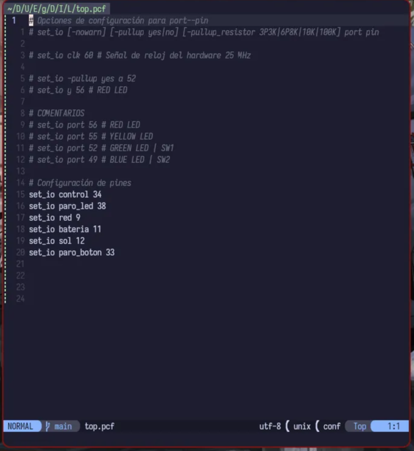
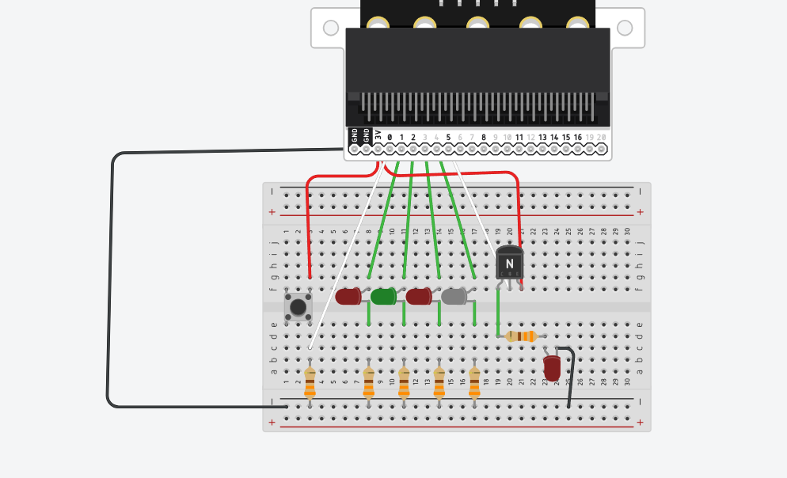
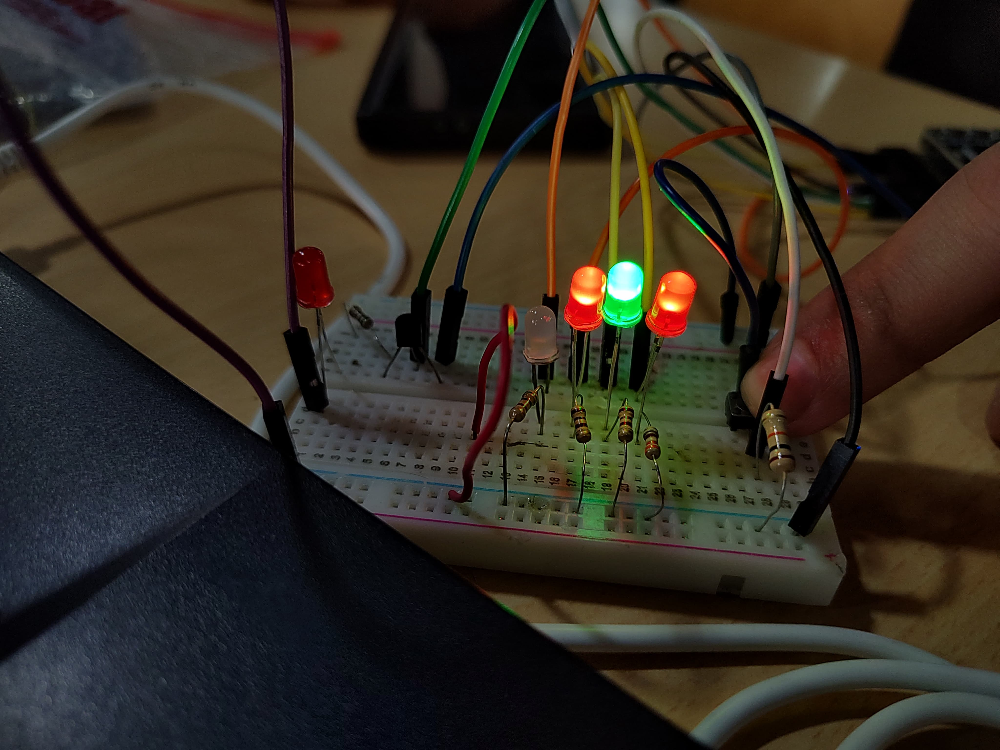

# Mi primer diseño

Farelo Sanabria, Édgar Enrique efarelo@unal.edu.co

Gómez Romero, Néstor Javier negomezr@unal.edu.co

## Link del video: [https://youtu.be/3UpZLviFcQ0](https://youtu.be/3UpZLviFcQ0)

### Introduccion:

La segunda practica de laboratorio requiere el diseño e implementación de un tablero de control que me registre las salidas de sensores que me indican carga de bateria, presencia de sol y red electrica, ademas de esto un paro de emergencia que impida el paso de la linea de potencia (red electrica). Por ende los materiales a usar fueron los siguientes:

### Linea de control:

2 leds rojos (paro de emergencia e indicador sol).

1 leds verde ( Indicador Batería).

1 led blanco ( Indicador Red Eléctrica).

1 botón.

Resistencias correspondientes.

### Linea de potencia:

1 led rojo. 

1 transistor BJT. 

Resistencias correspondientes.

## Diseño:

### NOTA:

La imagen anteriormente mostrada no es el diseño usado para el codigo de verilog, solo es una implementacion de lo que se esperaba fisicamente y una aproximacion al circuito.

### Diseño comportamental:

Como se puede observar en la imagen tenemos 4 entradas, de las cuales 3 son para el tablero de control ( bateria, REDelectrica, SOL ) la unica entrada que tiene un efecto bajo la linea de potencia es PARODEEMERGENCIA, la cual me permite desactivar el paso de la linea de potencia del sistema. Por ende en la siguiente parte del diseño se definio como implementar la FPGA y sus acciones.

Por decision de diseño, se optó por mandar las entradas desde la FPGA, la unica entrada con medio fisico sera el paro de emergencia,  a las demas entrada correspondientes se le asignó un valor constante para poder ser observado en el circuito.

### Diseño estructural:

Primeramente se definió el como observar las salidas correspondientes de los sensores, los cuales se observaran por medio de LEDS, el paro de emergencia entrara a la fpga por medio de control de un boton en pull-down. Para la linea de potencia y controlar esta se uso otra salida en funcion de la entrada del boton pull-down, la cual va conectada a la base de un transistor BJT, permitiendo usar este como interruptor para impedir o permitir el paso de corriente, para poder observar este proceso de manera fisica se uso un led que nos indica en que momento el paro de emergencia impide el paso de corriente.

### Codigo:

### Archivo .v

El archivo .v despues del diseño se definieron las siguientes variables: 

paro_boton, la cual es una entrada. Mientras que paro_led,  bateria, sol, red y control; son salidas.

bateria y sol tienen un valor constante de 1, para mantenerse siempre encendidas puesto que en realidad su valor depende del sensor.

paro_led va en funcion de paro_boton.

control es inversa a paro_boton, desactivando la base del BJT y por ende el paso de corriente.

### Archivo .pcf

### Circuito:

red es inversa a paro_boton, permitiendo que el led de Red tambien se apague al momento de activar el paro.

Las resistencias estan conectas en catodo comun a tierra con resistencias, el anodo se conecta a un pin de la fpga, el boton usa el formato pull-down, por ende va conectado de un lado a la alimentacion de la fpga (5v) y la otra en paralelo a un pin y la resistencia que en su otro extremo llega a tierra. Por ultimo, la linea de potencia manejada por el BJT conecta primero el emisor a la alimentacion de la fpga (5v), la base a un pin de la fpga que es nuestra salida de control, y por ultimo el colector a una resistencia que conecta al anodo del led y el catodo finalmente a tierrra.

 

.jpeg)

