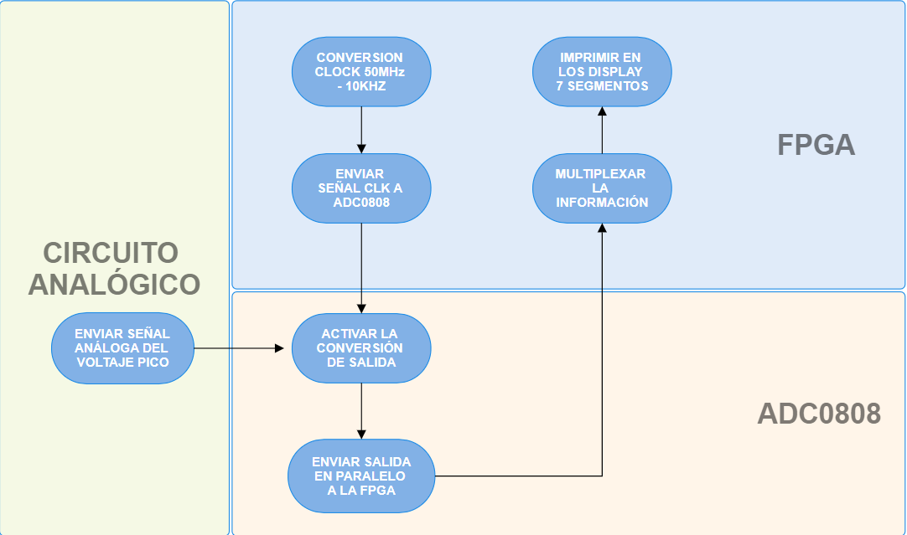

# INFORME 3 -  VOLTIMETRO ELECTRÓNICA DIGITAL

Farelo Sanabria, Édgar Enrique efarelo@unal.edu.co

Gómez Romero, Néstor Javier negomezr@unal.edu.co

## Introducción

Uno de los principales retos durante el aprendizaje de la lógica digital se centra en el conocimiento de obtener datos y convertirlos a requerimiento del diseño. Por eso esta practica es fundamental para apropiarse de conceptos básicos tanto en programación con lenguaje descriptivo de hardware y de módulos ADC y como se usan en conjunto con una FPGA.

## Desarrollo de la practica

### Dominio comportamental



Podemos dividir en 3 grandes subcapas la practica (analógica, conversión y digital) de la subcapa digital se encarga el circuito analógico que gracias a componentes transforma la señal AC de 110v a 5v los cuales se encarga de convertir el ADC para al final enviar la información de 8 bits en paralelo a la fpga que se encarga de la subcapa digital para multiplexar los datos en unidades, decenas y centenas que serian impresas respectivamente en displays 7 segmentos.

Código test_display:

```verilog
module test_display (
    input clk,              // Reloj del sistema (50 MHz)
    output [7:0] seg,       // Salida a los 7 segmentos
    output [3:0] selector,   // Selector de dígito: [3]=miles, [2]=centenas, [1]=decenas, [0]=unidades
	 output clk_out,
	 input [7:0] adc_datos
);

  reg [7:0] adc_data;
  
divFreq #(
      .FREQ_IN (50e6),
      .FREQ_OUT(10000)
  ) adc (
      .CLK_IN (clk),
      .CLK_OUT(clk_out)
  );
  
  always @(posedge clk) begin;
          adc_data <= adc_datos;
end
  // Instanciación del módulo que convierte el valor ADC a BCD y lo muestra en los 7 segmentos.
  adc_to_display display_inst (
      .clk(clk),
      .adc_data(adc_data),
      .seg(seg),
      .selector(selector)
  );

endmodule
```

El primer modulo que encontramos es test_display, donde encontramos instanciado el divisor de frecuencias para enviarle al ADC y la escritura de datos en el registro acd_data, el cual se envia a adc_to_display. Este modulo corresponde al top-entity del  proyecto.

Conversor adc_to_display.v:

```verilog
module adc_to_display (
    input clk,
    input [7:0] adc_data,  // Valor del ADC (0-255)
    output reg [7:0] seg,  // Patrón para los 7 segmentos (formato .gfedcba, activo bajo)
    output reg [3:0] selector // Selección del dígito (activo bajo: 0 activa)
);

  // Parámetros para los patrones de los números en un display de 7 segmentos (.gfedcba)
  // Donde 0 enciende el segmento y 1 lo apaga.
  parameter [7:0] ZERO  = 8'b11000000; // 0
  parameter [7:0] ONE   = 8'b11111001; // 1
  parameter [7:0] TWO   = 8'b10100100; // 2
  parameter [7:0] THREE = 8'b10110000; // 3
  parameter [7:0] FOUR  = 8'b10011001; // 4
  parameter [7:0] FIVE  = 8'b10010010; // 5
  parameter [7:0] SIX   = 8'b10000010; // 6
  parameter [7:0] SEVEN = 8'b11111000; // 7
  parameter [7:0] EIGHT = 8'b10000000; // 8
  parameter [7:0] NINE  = 8'b10010000; // 9

  // Registros para las cifras decimales
  reg [3:0] centenas;
  reg [3:0] decenas;
  reg [3:0] unidades;
  
  // Conversión simple a decimal:
  // centenas = (adc_data / 100) % 10;  
  // decenas  = (adc_data / 10)  % 10;  
  // unidades = adc_data % 10;
  always @(*) begin
    centenas = (adc_data / 100) % 10;
    decenas  = (adc_data / 10)  % 10;
    unidades = adc_data % 10;
  end
  
  // Multiplexado del display:
  // Usamos un contador para actualizar el dígito mostrado cada ~1ms.
  reg [1:0] display_index = 2'd0; // 0: centenas, 1: decenas, 2: unidades, 3: ciclo en blanco
  reg [15:0] scan_counter = 16'd0;
  localparam SCAN_MAX = 16'd50000; // Aproximadamente 1ms para clk=50MHz
  
  always @(posedge clk) begin
      if (scan_counter == SCAN_MAX - 1) begin
          scan_counter <= 16'd0;
          display_index <= display_index + 1;
      end else begin
          scan_counter <= scan_counter + 1;
      end
  end
  
  // Selección del dígito y asignación del patrón a 'seg'
  // Se asume que en 'selector', el bit 3 es miles, bit 2 es centenas, bit 1 es decenas y bit 0 es unidades.
  // Como no usamos miles, ese bit siempre estará apagado (1, activo alto para desactivar).
  always @(*) begin
    case (display_index)
      2'd0: begin // Dígito de centenas
             // Si adc_data es menor a 100, no mostrar el dígito (se deja en blanco)
             if (adc_data < 100)
               seg = 8'b11111111;  // Apagado
             else begin
               case (centenas)
                 4'd0: seg = ZERO;
                 4'd1: seg = ONE;
                 4'd2: seg = TWO;
                 4'd3: seg = THREE;
                 4'd4: seg = FOUR;
                 4'd5: seg = FIVE;
                 4'd6: seg = SIX;
                 4'd7: seg = SEVEN;
                 4'd8: seg = EIGHT;
                 4'd9: seg = NINE;
                 default: seg = 8'b11111111;
               endcase
             end
             // Activa únicamente el dígito de centenas (bit2 = 0)
             selector = 4'b1011; 
           end
      2'd1: begin // Dígito de decenas
             // Si adc_data es menor a 10, se deja en blanco (no hay decenas significativas)
             if (adc_data < 10)
               seg = 8'b11111111;
             else begin
               case (decenas)
                 4'd0: seg = ZERO;
                 4'd1: seg = ONE;
                 4'd2: seg = TWO;
                 4'd3: seg = THREE;
                 4'd4: seg = FOUR;
                 4'd5: seg = FIVE;
                 4'd6: seg = SIX;
                 4'd7: seg = SEVEN;
                 4'd8: seg = EIGHT;
                 4'd9: seg = NINE;
                 default: seg = 8'b11111111;
               endcase
             end
             // Activa el dígito de decenas (bit1 = 0)
             selector = 4'b1101;
           end
      2'd2: begin // Dígito de unidades
             case (unidades)
                 4'd0: seg = ZERO;
                 4'd1: seg = ONE;
                 4'd2: seg = TWO;
                 4'd3: seg = THREE;
                 4'd4: seg = FOUR;
                 4'd5: seg = FIVE;
                 4'd6: seg = SIX;
                 4'd7: seg = SEVEN;
                 4'd8: seg = EIGHT;
                 4'd9: seg = NINE;
                 default: seg = 8'b11111111;
             endcase
             // Activa el dígito de unidades (bit0 = 0)
             selector = 4'b1110;
           end
      default: begin // Cuando display_index es 3, apagamos el display
                 seg = 8'b11111111;
                 selector = 4'b1111;
               end
    endcase
  end

endmodule
```

El segundo modulo es adc_to_display en el cual guardamos todas las constantes correspondientes a cada número en el 7 segmentos, además este modulo se encarga de recibir la escritura de datos proveniente de test_display y multiplexarla para enviarla a los 7 segmentos.

Código divFreq.v:

```verilog
// filename: divFreq.v
module divFreq #(
    parameter integer FREQ_IN = 1000,
    parameter integer FREQ_OUT = 100,
    parameter integer INIT = 0
) (
    // Inputs and output ports
    input CLK_IN,
    output reg CLK_OUT = 0
);

  localparam integer COUNT = (FREQ_IN / FREQ_OUT) / 2;
  localparam integer SIZE = $clog2(COUNT);
  localparam integer LIMIT = COUNT - 1;

  // Declaración de señales [reg, wire]
  reg [SIZE-1:0] count = INIT;

  // Descripción del comportamiento
  always @(posedge CLK_IN) begin
    if (count == LIMIT) begin
      count   <= 0;
      CLK_OUT <= ~CLK_OUT;
    end else begin
      count <= count + 1;
    end
  end
endmodule

```

El ultimo modulo corresponde a el divisor de frecuencia que permite convertir los 50MHz a 10KHz, necesarios para el correcto funcionamiento del reloj del ADC.

### Dominio estructural


En el dominio estructural encontramos primeramente la conexión física de los dispositivos.


En el diagrama de caja negra, obsevamos 2 entradas, la cual corresponde a la escritura de datos recibida por el ADC y el clock interno de la fpga, esta data llega adc to display donde se multiplexara, clock conecta a las siguientes dos cajas negras, una para el divisor de frecuencia y otra que también entra al multiplexado que esta sincronizado con el reloj. Por ultimo tenemos 3 salidas, Seg que hace referencia a los 8 leds del 7 segmentos (contando el punto) y que me indicara que leds han de encenderse para mostrar el número deseado. Selector, selecciona que 7 segmentos mostrara el número requerido para diferenciar unidades, decenas y centenas, por ultimo clk_out es la frecuencia dividida para llegar a 10KHz y enviarlo al clock del ADC.

RTL general


rtl adc_to_display.v


### Dominio físico

## Resultados

A continuación se adjunta el video de la demostración de su funcionamiento
[https://youtu.be/cmZQxzgxz-I](Video informe del laboratorio 3 - Gómez, Farelo)

## Análisis de resultados

Durante la practica se encontraron varios desafíos tales como la presencia de ruido en el circuito. Tambien, como una mala interpretación del datasheet para la selección del canal. Hubieron resultados satisfactorios, teniendo un valor de 4 cuando no estaba conectado el transformador y de 172 cuando se conecta a la corriente.

## Referencias

[1] https://www.alldatasheet.es/datasheet-pdf/pdf/8097/NSC/ADC0808.html

[https://www.alldatasheet.es/datasheet-pdf/pdf/8097/NSC/ADC0808.html](https://www.alldatasheet.es/datasheet-pdf/pdf/8097/NSC/ADC0808.html)
