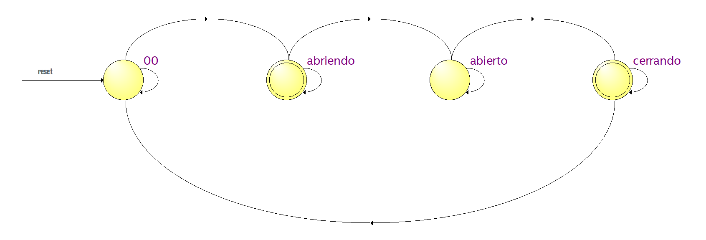

# Informe 4- Maquina de estados

Farelo Sanabria, Édgar Enrique efarelo@unal.edu.co

Gómez Romero, Néstor Javier negomezr@unal.edu.co

## Introducción

Para definir un alimentador automático para mascotas es indispensable un sistema que se encargue principalmente de la salida controlada de alimento, en este caso por medio de motores que accionan una puerta que permiten la salida. Aunque sencilla, esta máquina de estados es el eje principal del proyecto, pues esta define lo que le da el nombre de alimentador automático.

## Desarrollo de la practica

Como primer observación tenemos el codigo en verilog de los dos módulos necesarios para la máquina de estados y el correcto funcionamiento.

### Dominio comportamental

```verilog
module divFreq #(
    parameter integer FREQ_IN = 1000,
    parameter integer FREQ_OUT = 100,
    parameter integer INIT = 0
) (
    // Inputs and output ports
    input CLK_IN,
    output reg CLK_OUT = 0
);

  localparam integer COUNT = (FREQ_IN / FREQ_OUT) / 2;
  localparam integer SIZE = $clog2(COUNT);
  localparam integer LIMIT = COUNT - 1;

  // Declaración de señales [reg, wire]
  reg [SIZE-1:0] count = INIT;

  // Descripción del comportamiento
  always @(posedge CLK_IN) begin
    if (count == LIMIT) begin
      count   <= 0;
      CLK_OUT <= ~CLK_OUT;
    end else begin
      count <= count + 1;
    end
  end
endmodule
```

Primeramente observamos divFreq, el cual corresponde a un modulo cedido por el profesor, que se encontró en Github, para realizar una fracción del reloj de la FPGA, este es necesario para disminuir la frecuencia de nuestro reloj a solo 10Hz que es número mas cotidiano en para un movimiento que esta alrededor de los 0.6s para generar 90º de giro en los motorreductor.

```verilog
module puerta(
    output reg [3:0] salida_motor,
    input clk,
	 input ON,
	 input clousexd,
	 output wire prueba
);
// *******SECCIÓN 1********* //
wire clock;
reg [3:0]counter = 4'd0000;
reg [3:0]counter2 = 4'd0000;     
localparam abierto =2'b11;
localparam abriendo =2'b10;
localparam cerrado =2'b00;
localparam cerrando =2'b01;
reg [1:0] state = 2'b00;
reg pulseA=0;
reg pulseB=0;
assign prueba = pulseA;

always@(posedge clock) begin

	if(~ON || counter>0 && counter<6) begin
	counter <= counter +1;
	pulseA=0;
	end else begin
	pulseA=1;
	counter<=0;

		end
	if(~clousexd || counter2>0 && counter2<6) begin
	counter2 <= counter2 +1;
	pulseB=0;
	end else begin
	pulseB=1;
	counter2<=0;
	end
	
	end
divFreq #(
    .FREQ_IN(50e6),
    .FREQ_OUT(10)
) adc (
    .CLK_IN(clk),
    .CLK_OUT(clock)
);

// ********** SECCIÓN 2 ********//
always @(posedge clock) begin
	case(state)
	 cerrado: begin
		if (~ON) begin
			state <= abriendo;
		end
    end
	 cerrando: begin
		if (pulseB) begin
			state <= cerrado;
		end
    end
	 abierto: begin 
		if(~clousexd) begin
			state <=cerrando;
		end
    end
	 abriendo: begin
		if(pulseA) begin
			state <=abierto;
		end
    end
	 default: state<= cerrado;
	 endcase
end
always @(*) begin
	case(state)
	cerrado: begin
		salida_motor <= 4'b0000;	
	end
	cerrando: begin
		salida_motor <=4'b0110;
	end
	abierto: begin
		salida_motor <=4'b0000;
	end
	abriendo: begin
		salida_motor <=4'b1001;
	end
	endcase
end
endmodule

```

Como segundo módulo y top-entity del proyecto tenemos puerta, donde se define la máquina de estados y los contadores que usan el divisor de frecuencia para tener un giro más preciso, primero se definen en la sección 1 la codificación de los estados requeridos las entradas, registros y salidas. Siendo ON y clousexd señales de boton que envian el abrir o cerrar respectivamente, counter y counter2 que son los registros que llevaran el valor del conteo, pulseA y pulseB que definen cuando counter y counter2 terminan. Los contadores tienen exactamente la misma estructura pero se activan con señales diferentes, uno con abrir y otro con cerrar, de esta manera se separa el contador para cada movimiento y evita errores al momento de oprimir una señal no deseada como ON cuando el estado es abierto.

En la sección dos encontramos la máquina de estados que esta separada en logica de estado futuro y logica de salida. La logica de estado futuro se realiza con un *posedge clock* que me indica que señales cambiaran el estado, siendo ON y clousexd los que pasan de estado abierto y cerrado a los estados intermedios de abriendo y cerrando, los cuales no pasaran al siguiente estado con una señal de boton o externa si no cuando los contadores manden el pulso al terminar de contar. Por ultimo vemos la logica de salida, la cual simplemente define por medio del registro de salida_motor qué señal se le enviará al módulo para hacer girar los motores.



La máquina de estados utilizada se basa en 4 estados, el estado de reset ó 00 corresponde a cerrado. Como se explicó, anteriormente los estados abierto y cerrado se consideran estados de espera, pues se espera a la señal que me genere la apertura o cierre de la puerta, los estados abriendo y cerrando se consideran estados intermedios en los cuales hay movimiento de los motores y los cuales automáticamente pasado el tiempo definido van a llegar otra vez a los estados de espera.

### Dominio estructural


El daigrama RTL nos indica las cajas negras que se encuentran en el sistema, podemos ver que todo el sistema en conjunto cuenta con 3 entradas y 1 salida de 3 bits (prueba no es contado como salida final del sistema, pues, fue implementada para conseguir medir el tiempo necesario de giro, pero no resulta relevante en el diseño final), podemos observa que la logica más importante del sistema es los contadores, pues, son los que me definen los tiempos y los pulsos para cambiar los estados del sistema, a su vez tenemos sumadores que son retroalimentados por los contadores. Toda esta lógica llega a un módulo principal que es un registro de Flip-Flops que guardan el estado que se muestra y las salidas correspondientes, lo cual es al final nuestra máquina de estados.


## Registro de síntesis


## Resultados

A continuación se adjunta el video de la demostración de su funcionamiento.

[Video Informe 4 - Gómez,Farelo](https://youtu.be/vRsfxx1cvaw)

